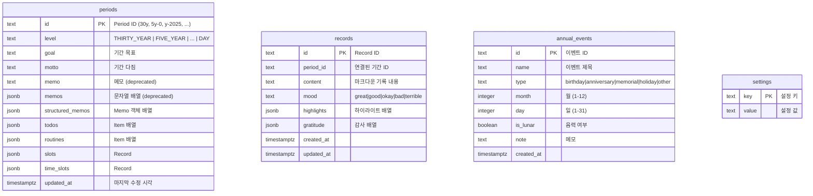

# Life Planner - 아키텍처 다이어그램

이 문서는 Life Planner 프로젝트의 전체 아키텍처를 Mermaid.js 다이어그램으로 설명합니다.
7단계 프랙탈 계층형 인생 계획 시스템의 구조, 데이터 흐름, 상태 관리, 동기화 메커니즘을 시각적으로 표현합니다.

---

## 목차

1. [전체 시스템 아키텍처](#1-전체-시스템-아키텍처)
2. [폴더 및 모듈 구조](#2-폴더-및-모듈-구조)
3. [7단계 프랙탈 계층 구조](#3-7단계-프랙탈-계층-구조)
4. [데이터 흐름](#4-데이터-흐름)
5. [상태 관리 아키텍처](#5-상태-관리-아키텍처)
6. [드래그앤드롭 흐름](#6-드래그앤드롭-흐름)
7. [클라우드 동기화 흐름](#7-클라우드-동기화-흐름)

---

## 1. 전체 시스템 아키텍처

C4 Context 수준의 시스템 개요입니다.
브라우저 클라이언트, Next.js App Router 서버, 외부 서비스(Supabase, Google Gemini AI)의 관계를 보여줍니다.
클라이언트는 Zustand 스토어를 통해 상태를 관리하고, Supabase와 실시간 동기화하며, AI 어시스턴트를 위해 Gemini API와 통신합니다.

---

## 2. 폴더 및 모듈 구조

프로젝트의 소스 코드 구조와 모듈 간 의존 관계입니다.
`app/` 디렉토리는 Next.js App Router 페이지를, `views/`는 실제 뷰 컴포넌트를, `components/`는 재사용 UI를, `store/`는 전역 상태를, `lib/`는 유틸리티를, `types/`는 타입 정의를 담당합니다.
화살표는 import 의존 방향을 나타냅니다.

---

## 3. 7단계 프랙탈 계층 구조

Life Planner의 핵심 개념인 7단계 프랙탈 계층입니다.
각 레벨은 상위 레벨의 하위 기간으로 구성되며, 최상위 30년 계획부터 최하위 일간 시간대 슬롯까지 드릴다운할 수 있습니다.
각 노드에는 하위 기간 개수와 그리드 레이아웃, Period ID 형식을 표기합니다.

### 기간 내부 데이터 구조

각 기간(Period)은 다음 구조를 가집니다.

---

## 4. 데이터 흐름

### 4-1. 앱 초기화 흐름

앱이 시작될 때의 데이터 로딩 시퀀스입니다.
`layout.tsx`가 `CloudInitializer`를 래핑하고, `CloudInitializer`는 `initializeFromCloud()`를 호출하여 Supabase에서 데이터를 가져온 뒤 Zustand 스토어에 주입합니다.
데이터 로딩이 완료될 때까지 로딩 스피너가 표시됩니다.

### 4-2. 사용자 액션 -> 자동 동기화 흐름

사용자가 할일 추가, 완료 토글 등 액션을 수행하면 Zustand 스토어가 업데이트되고,
모듈 레벨 구독자가 변경을 감지하여 2초 디바운스 후 Supabase에 자동 업로드합니다.

---

## 5. 상태 관리 아키텍처

`usePlanStore`는 Zustand로 구현된 메인 스토어로, 2100줄 이상의 코드를 포함합니다.
상태 슬라이스(state slices)와 액션 그룹을 아래 다이어그램으로 분류합니다.
스토어는 localStorage에 persist되지 않고 Supabase 동기화에 의존하며,
모듈 레벨 `subscribe()`로 변경 감지 후 자동 클라우드 동기화를 수행합니다.

---

## 6. 드래그앤드롭 흐름

FractalView의 3컬럼 레이아웃에서 드래그앤드롭이 어떻게 동작하는지 보여줍니다.
좌측 패널(할일)과 우측 패널(루틴)에서 아이템을 중앙의 하위 기간 그리드 셀이나 시간대 슬롯으로 드래그합니다.
`assignToSlot`은 아이템을 슬롯에 배정하면서 하위 기간에도 전파(propagation)하는 핵심 로직입니다.

### assignToSlot 전파 상세 흐름

`assignToSlot`이 호출되면 단순히 슬롯에 아이템을 추가하는 것이 아니라,
하위 기간의 할일 목록에도 전파(propagation)합니다. 이로써 상위 계획이 하위 실행 단위까지 연결됩니다.

### toggleComplete 연쇄 업데이트

완료 토글은 단순하지 않습니다. 자식 항목들을 재귀적으로 같은 상태로 변경하고,
부모 체인의 달성률을 재계산합니다. 모든 기간에 걸쳐 동기화됩니다.

---

## 7. 클라우드 동기화 흐름

Supabase를 이용한 클라우드 동기화의 전체 사이클입니다.
동기화는 두 가지 경로로 이루어집니다:
1) 앱 시작 시 `initializeFromCloud` -> `syncFromCloud`으로 클라우드 데이터를 로드하고 LWW(Last-Write-Wins) 병합
2) 상태 변경 시 모듈 레벨 `subscribe`가 감지하여 `autoSyncToCloud` (2초 디바운스)로 업로드

### Supabase 테이블 구조

### 동기화 상태 머신

`sync.ts`의 동기화 상태(SyncStatus)는 4개의 상태를 순환합니다.
리스너 패턴으로 UI에 실시간으로 동기화 상태를 알립니다.

### initSyncFromCloud LWW 병합 전략

앱 시작 시 로컬과 클라우드 데이터가 모두 존재할 때의 병합 전략입니다.
LWW(Last-Write-Wins) 원칙을 따르되, Period와 Record는 로컬 우선, AnnualEvent는 클라우드 우선입니다.

### 자동 동기화 구독 메커니즘 상세

스토어의 모듈 레벨 `subscribe`가 어떻게 변경을 감지하고 동기화를 트리거하는지 보여줍니다.
이 구독은 브라우저 환경(`typeof window !== 'undefined'`)에서만 활성화됩니다.

---

## 부록: 카테고리 시스템

### 할일 카테고리 (TodoCategory)

| 카테고리 | 라벨 | 색상 |
|---------|------|------|
| `personal` | 개인 | amber |
| `work` | 업무 | violet |
| `other` | 기타 | slate |

### 루틴 카테고리 (Category)

| 카테고리 | 라벨 | 색상 |
|---------|------|------|
| `work` | 업무/학습 | blue |
| `health` | 건강/운동 | green |
| `relationship` | 관계/소통 | rose |
| `finance` | 재정/생활 | amber |
| `growth` | 성장/취미 | purple |
| `uncategorized` | 미분류 | gray |

### 기분 (Mood)

| 값 | 라벨 | 이모지 |
|---|------|--------|
| `great` | 최고 | :grinning_squinting_face: |
| `good` | 좋음 | :smiling_face_with_smiling_eyes: |
| `okay` | 보통 | :neutral_face: |
| `bad` | 별로 | :pensive_face: |
| `terrible` | 최악 | :crying_face: |

### 기념일 유형 (AnnualEventType)

| 값 | 라벨 | 이모지 |
|---|------|--------|
| `birthday` | 생일 | :birthday_cake: |
| `anniversary` | 기념일 | :couple_with_heart: |
| `memorial` | 기일 | :candle: |
| `holiday` | 공휴일 | :party_popper: |
| `other` | 기타 | :calendar: |
